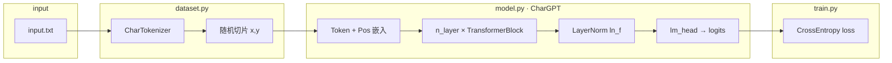
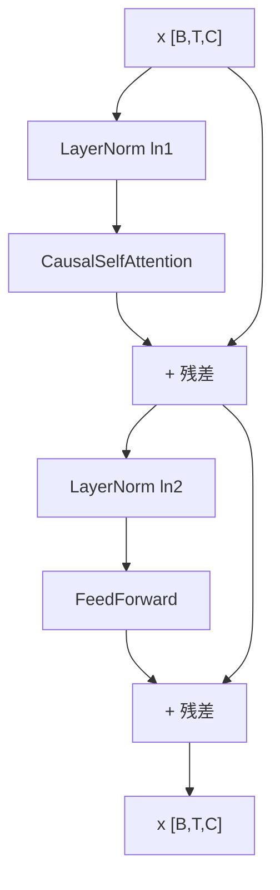

# Char-GPT 项目架构说明

本文档说明**语料来源**、**模块划分**，以及 **Transformer 各环节与代码的对应关系**（便于对照论文/公式阅读源码）。

---

## 1. 训练语料

| 项目 | 说明 |
|------|------|
| 文件 | 仓库根目录下的 `input.txt` |
| 配置项 | `config.py` 中 `data_path: str = "input.txt"` |
| 加载方式 | `train.py` 调用 `dataset.load_text_and_tokenizer(config.data_path)`，读取**整份文件**为字符串 |
| 词表 | `dataset.CharTokenizer`：对语料中**出现过的字符**去重、排序后建立 `char ↔ idx`，**不引入外部词表** |
| 训练目标 | 字符级下一 token 预测：`y[t] = x[t+1]`（见 `dataset.iter_train_batches`） |

---

## 2. 代码文件职责

| 文件 | 职责 |
|------|------|
| `config.py` | 超参数：`batch_size`、`block_size`、`n_embd`、`n_head`、`n_layer`、学习率、迭代次数、数据路径与 checkpoint 名等 |
| `dataset.py` | 读文本、`CharTokenizer`、`get_batch` / `iter_train_batches` 构造 `(x, y)` |
| `model.py` | **手写** Token/位置嵌入、因果多头注意力、FFN(GELU)、Pre-LN 块、LM Head（**未使用** `nn.Transformer`） |
| `train.py` | 训练循环、按 `log_interval` 打印 loss、保存 `base_model.pth`（含权重、`config` 字典、有序字符表 `chars`） |
| `generate.py` | 加载 checkpoint，自回归采样生成文本 |

---

## 3. 整体数据流（架构图）

---

## 4. 单个 TransformerBlock（Pre-LN）

与常见 GPT 类实现一致：**先 LayerNorm，再子层，再残差**。

对应类：`model.py` 中的 `TransformerBlock`（内含 `CausalSelfAttention`、`FeedForward`）。

---

## 5. Transformer 各环节：公式 ↔ 实现位置

### 5.1 嵌入

- **Token Embedding**：`nn.Embedding(vocab_size, n_embd)`，输入 `idx [B, T]` → `[B, T, C]`。
- **位置 Embedding**：可学习参数 `pos_emb`，形状 `[1, block_size, C]`，取 `[:, :T, :]` 与 token 嵌入相加。
- **代码**：`CharGPT.__init__` / `CharGPT.forward`（`model.py`）。

### 5.2 多头因果自注意力

- **Q、K、V 线性投影**：三个独立 `nn.Linear(C, C)`：`q_proj`、`k_proj`、`v_proj`。
- **拆多头**：`C = n_head * head_dim`，reshape 为 `[B, n_head, T, head_dim]`。
- **缩放点积**：  
  \(\mathrm{Attention}(Q,K,V)=\mathrm{softmax}\bigl(\frac{QK^\top}{\sqrt{d_k}}\bigr)V\)，其中 \(d_k=\) `head_dim`。  
  张量形状在源码注释中已标出，例如  
  `[B, nh, T, hs] @ [B, nh, hs, T] -> [B, nh, T, T]`。
- **因果掩码**：`torch.tril` 得到下三角为 1；在注意力 logits 上对**未来位置**填 `-inf`，保证位置 \(t\) 不可见 \(t+1,\ldots,T-1\)。
- **输出投影**：多头合并后经 `out_proj` 回到 `[B, T, C]`。
- **代码**：`CausalSelfAttention`（`model.py`）。

### 5.3 前馈网络 FFN

- **结构**：`Linear(C → 4C)` → **GELU** → `Linear(4C → C)`（与常见 GPT 宽度一致）。
- **代码**：`FeedForward`（`model.py`）。

### 5.4 输出头

- **最后一层 LayerNorm**：`ln_f`。
- **语言模型头**：`lm_head: Linear(C → vocab_size)`，得到每个时间步对词表各字符的 **logits**。
- **训练损失**：将 `logits` reshape 为 `[B*T, vocab]`，与 `y [B, T]` 做 `cross_entropy`。
- **代码**：`CharGPT.forward`（`model.py`）；训练在 `train.py`。

### 5.5 推理生成

- 取当前序列（最多最近 `block_size` 个 token）前向；对**最后一个位置**的 logits 做 `softmax`，再 `multinomial` 采样下一个 id，拼接到序列末尾并重复。
- **代码**：`CharGPT.generate`（`model.py`）；命令行入口 `generate.py`。

---

## 6. 张量形状约定（与 `model.py` 注释一致）

| 符号 | 含义 |
|------|------|
| `B` | batch size |
| `T` | 序列长度（≤ `block_size`） |
| `C` | `n_embd`，模型宽度 |
| `nh` | `n_head` |
| `hs` | `head_dim = n_embd // n_head` |
| `V` | `vocab_size` |

---

## 7. 阅读源码建议顺序

1. `config.py`：弄清 `block_size`、`n_embd`、`n_head`、`n_layer`。  
2. `dataset.py`：`CharTokenizer` → `iter_train_batches` 如何构造 `x, y`。  
3. `model.py`：按 `CausalSelfAttention` → `FeedForward` → `TransformerBlock` → `CharGPT` 顺序读。  
4. `train.py` / `generate.py`：训练与采样流程。

若修改语料，只需替换或扩充 `input.txt` 并**重新训练**；词表大小会随新语料中的字符集合变化，旧 checkpoint 与新区词表不一致时不能直接混用，需重新训练或保证 `chars` 一致。
