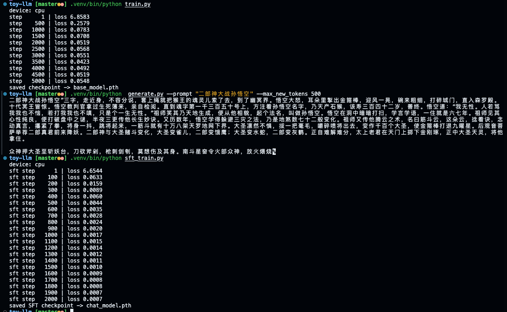

# Toy Char-GPT

从零用 PyTorch **手写 Transformer**（多头因果注意力、Pre-LN、GELU FFN）的**字符级语言模型**预训练与生成示例。语料为本地 `input.txt`，适合对照公式读代码。

---

## 环境准备

| 依赖 | 说明 |
|------|------|
| Python | 建议 3.10+ |
| PyTorch | CPU / CUDA 均可（无 GPU 时自动用 CPU） |

推荐使用虚拟环境，避免污染系统 Python：

```bash
python3 -m venv .venv
source .venv/bin/activate          # Windows: .venv\Scripts\activate
pip install -r requirements.txt
```

---

## 三步走（关键步骤）



### ① 准备语料

编辑项目根目录下的 **`input.txt`**，放入你要学习的纯文本（中英混排、换行均可）。训练时会用其中**出现过的全部字符**构建词表。

### ② 预训练

在项目根目录执行：

```bash
python train.py
```

- 按 `config.py` 中的 `max_iters`、`log_interval` 训练；默认每 **500** 步打印一次 loss。
- 结束后生成 **`base_model.pth`**（含权重、配置与词表，供生成脚本使用）。


若已创建虚拟环境且未激活，也可：

```bash
.venv/bin/python train.py
```

### ③ 生成文本

```bash
python generate.py --prompt "孙悟空回花果山" --max_new_tokens 200
```

- `--prompt`：起始字符串（可为空或任意语料内字符）。
- `--max_new_tokens`：在 prompt 之后**续写**的字符数。
- 默认加载同目录下的 `base_model.pth`，可用 `--checkpoint 路径` 指定其它权重。

---

## ④ 指令微调（SFT，可选）

1. 确保 **`input.txt` 预训练语料**已包含 SFT 会用到的全部字符（含 `<`、`>`、`[`、`]`、`/`、模板与 JSONL 里的中英文字符），否则 `encode_checked` 会报错；必要时扩充 `input.txt` 后重新 `python train.py` 得到新的 **`base_model.pth`**。  
2. 按行编辑 **`sft_data.jsonl`**，每行形如：`{"instruction": "…", "answer": "…"}`。  
3. 从 `base_model.pth` 加载权重微调（默认学习率 `5e-5`，见 `config.py` 中 `sft_*`）：

```bash
.venv/bin/python sft_train.py
```

4. 保存为 **`chat_model.pth`** 后，交互对话（流式输出）：

```bash
.venv/bin/python chat.py
# 或指定权重：python chat.py --checkpoint chat_model.pth
```

- 编码模板与 `sft_dataset.py` 一致：`<s>[INST] {msg} [/INST] {ans} </s>`；**仅对 answer 与结束符 `</s>` 计 loss**（指令位置在 `targets` 中为 `ignore_index`）。  
- 若某条样本截断后不含 answer 起始，该条会在构建数据集时被丢弃。

---

## 项目结构（速查）

| 文件 | 作用 |
|------|------|
| `config.py` | 超参数（`batch_size`、`block_size`、`n_embd`、`n_head`、`n_layer`、SFT 与 `ignore_index` 等） |
| `dataset.py` | 读 `input.txt`、字符 tokenizer、训练用 `(x, y)` batch |
| `model.py` | Transformer 主体（**未使用** `nn.Transformer`）；交叉熵支持 `ignore_index` |
| `train.py` | 预训练循环与保存 `base_model.pth` |
| `sft_dataset.py` | JSONL 指令对、模板编码与 target-only mask |
| `sft_train.py` | 加载 `base_model.pth`，SFT 并保存 `chat_model.pth` |
| `chat.py` | 加载 SFT 权重，交互式对话（流式打印） |
| `generate.py` | 加载权重并自回归续写 |
| `ARCHITECTURE.md` | 架构说明、公式与代码对应关系 |

---

## 常见问题

- **改语料后**：需重新运行 `train.py`；词表随字符集合变化，旧 checkpoint 与新区词表不一致时勿混用。
- **更详细的架构与公式对照**：见 **[ARCHITECTURE.md](./ARCHITECTURE.md)**。

---

## License

见仓库内 `LICENSE`（若存在）。
